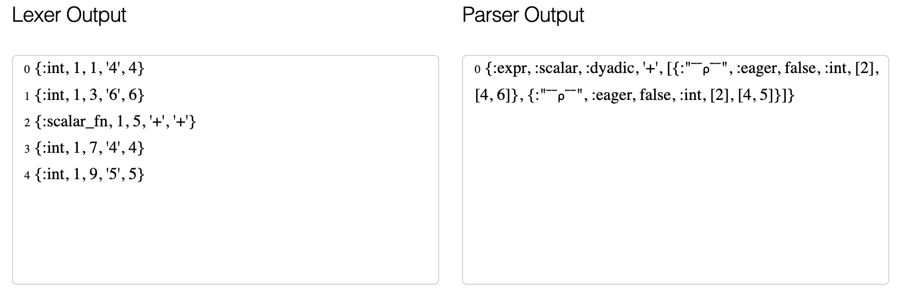
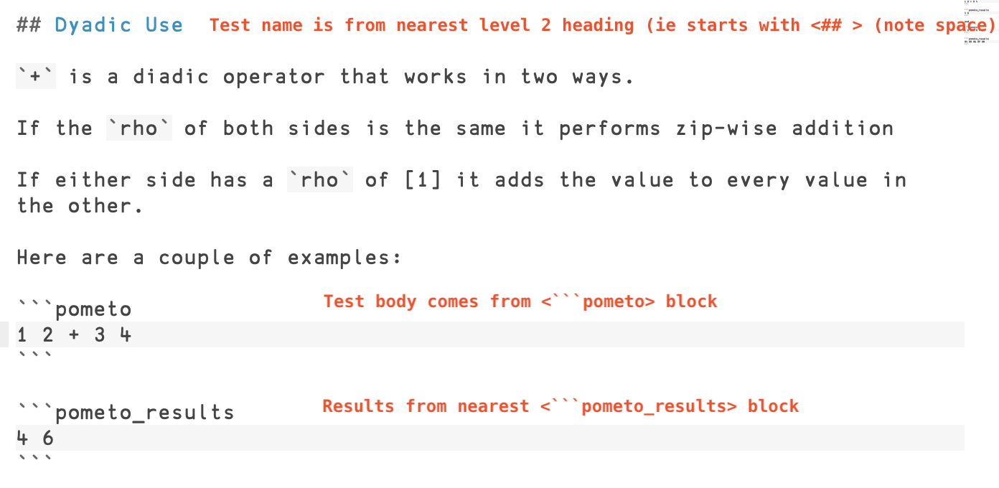

# Howdy

THIS PROJECT IS SUPER-EARLY, NOT SO MUCH ALPHA AS BEFORE THE DAWN OF WRITING, SOME INCHOATE SYMBOLS SCRAWLED WITH A HALF-BURNT STICK ON A CAVE WALL.

If you want to help develop it, dive in.

# Using Rappel

The main screen of `Rappel` allows you to run `Pometo` commands and displays the results in the main panel:


At the bottom you see a couple of checkboxes.

If you want to load from data from an arbritrary programme click the checkbox marked `bind data`. The syntax currently used is ***Erlang*** syntax for an `apply(mod, fn, [args])`


There is a test module that you can call to get dummy data as follows:

* module `Elixir.Rappel.TestData`
* function: `get_integers`
* args:

This will get you a vector of 3 random integers.

* module `Elixir.Rappel.TestData`
* function: `get_integers`
* args: 7

This will get you a vector of 7 random integers.

* module `Elixir.Rappel.TestData`
* function: `get_floats`
* args:

This will get you a vector of 3 random floats.

* module `Elixir.Rappel.TestData`
* function: `get_integers`
* args: 9

This will get you a vector of 9 random floats.

The arguments must at the moment be:

* integers
* floats (normal or scientific notation)
* atoms
* Erlang strings (`"double quoted"`)
* Erlang binaries (`<<"in brackets">>`)

`lists` and `tuples` are not currently supported.


There is also a debugger for inspecting the results of the `lex` and `parse` stages of the compiler




# How We Develop

Development is done inside a docker container.

The docker container mounts the local file system so code can be edited on your normal machine.

Ports are punched out from the firewall so that `rappel` can be started in a browser running from your normal host.

Scripts are provided that shell you into the running docker instance. 

The docker container is even jiggered so you can start X-Windows programmes and pop them out (though this is not really necessary).

## Work Elimination

We follow the principle of ***work elimination***. In this respect we work backwards. The user and reference documentation is written ***first*** and it acts as:

* the development specification
* the main test suite

There is a `rebar3` plugin called `pometo_docs_to_tests` which converts all `*.md` files in `docs` (and directories under it) into tests in `test/generated_tests/`.

The format of the docs is fairly straightforward.

To see how to write testable documentation please examine this screenshot:



The basic development protocol is:

* write a specification of how the system should work in `docs/` using the structured format
* generating the test suite with `rebar3 pometo_docs_to_tests`
* running the tests with `rebar3 eunit`
* writing code until the tests pass
* commit and push

DEVELOPMENT PROTOCOLS ARE NOT YET DEFINED:

* testing and CI (Continuous Integration)
* branches to push to
* pull requests and reviews
* etc, et bloody cetera

THESE ARE NEXT ON THE AGENDA

# Installation

You need to have `docker` installed on your machine.

https://docs.docker.com/get-docker/

You need to clone this repo, the `Pometo` repo, and the `LFE` repo side by side in your file system

`git clone git@github.com:gordonguthrie/pometo.git`
`git clone git@github.com:gordonguthrie/rappel.git`
`git clone git@github.com:rvirding/lfe.git`

Once the source code is available we bring up the `rappel` docker container

```
cd $GITROOT/rappel
docker-compose build
docker-compose up
```

This will leave docker running in that terminal. Switch to another terminal:

```
cd $GITROOT/rappel/scripts
sh start_rappel.sh
```

This will log you into the docker instance.

The `rappel` app is in the directory `/rappel` and `pometo` is in `/pometo`

To start `rappel` you should run the following commands inside the docker container:

```
cd /rappel
iex -S mix phx.server
```

And then open a browser with `http://localhost:4000`

`Elixir/Phoenix` has a good working/hot-reoadling cycle when developing the main `Elixir` app, not so good for changing dependencies on the fly.

The typical dev cycle is:

* edit code in the `Pometo` repository
* crash out of `iex` and the `rappel` app back to the command line
* restart `rappel` in `iex`

`Pometo` is all about the interopability - so developing it is currently in two languages (`Erlang` and `Elixir`) and depending on how the runtime pans out, potentially in three with `LFE` (or `Lisp Flavoured Erlang`) being the current compiler target of choice.

Typically compilers produce an `Abstract Syntax Tree` or `AST` as an output and oftentimes this is a `YASL` (`Yet Another Shitty Lisp`).

It makes sense to have a `LISP`-`LISP` for the `AST` and the proposed format is an `Erlang` data structure code-named `Liffey` which has the property that if you `to_string()` it, then it becomes `LFE` source code.