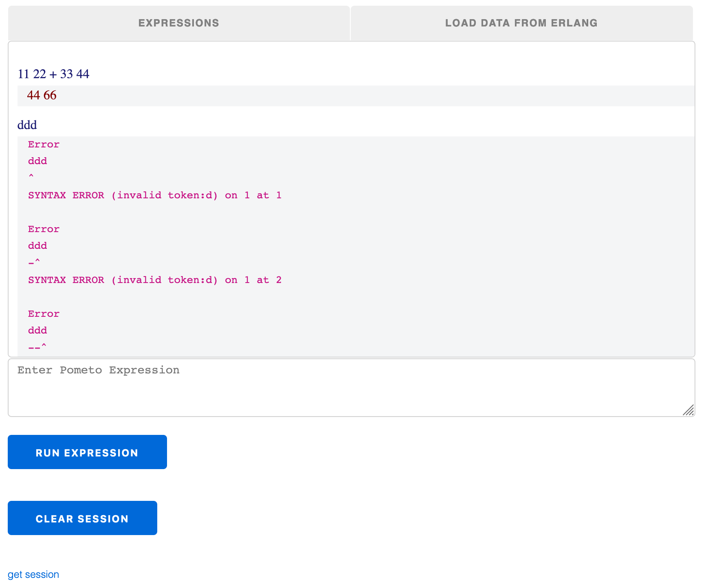
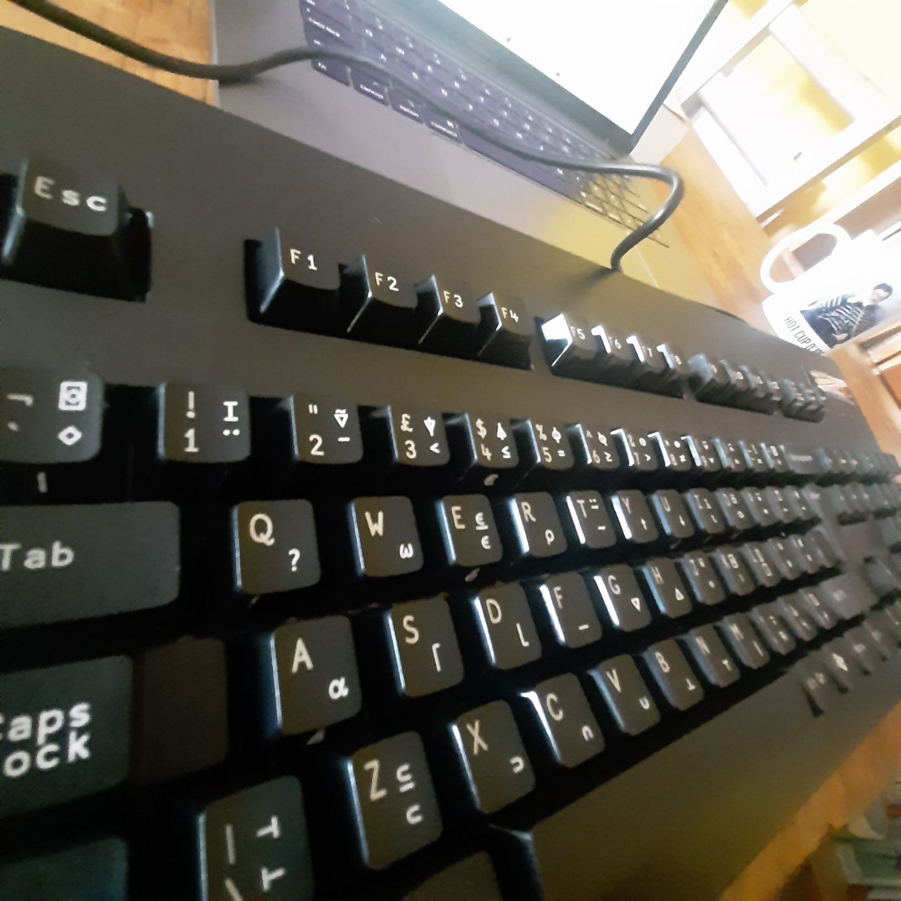

# Howdy

`Rappel` is the REPL for `pometo` - the little APL on the BEAM. You now that liquid bowel feeling you get when you rappel off the side of a sky scraper for charity and go down the rope? Well that's how some people feel the first time they see APL syntax, and it rhymes with REPL, sooo...

THIS PROJECT IS SUPER-EARLY, NOT SO MUCH ALPHA AS BEFORE THE DAWN OF WRITING, SOME INCHOATE SYMBOLS SCRAWLED WITH A HALF-BURNT STICK ON A CAVE WALL.

If you want to help develop it, dive in.

# About Pometo

`Pometo` has an [online manual](https://gordonguthrie.github.io/pometo/).

# Using Rappel

The main screen of `Rappel` allows you to run `Pometo` commands and displays the results in the main panel:



There is a javascript keyboard at the top that lets you put APL symbols in your code:


The tabs at the top let you switch between the main REPL and the external bindings page.

At the bottom there is a button to clear the session and a link that opens a new window with a text dump of your session. You can save and replay sessions at will.

The syntax currently used for loading data is ***Erlang*** syntax for an `apply(mod, fn, [args])`


There is a test module that you can call to get dummy data as follows:

* module `Elixir.Rappel.TestData`
* function: `get_integers`
* args:

This will get you a vector of 3 random integers.

* module `Elixir.Rappel.TestData`
* function: `get_integers`
* args: 7

This will get you a vector of 7 random integers.

* module `Elixir.Rappel.TestData`
* function: `get_floats`
* args:

This will get you a vector of 3 random floats.

* module `Elixir.Rappel.TestData`
* function: `get_integers`
* args: 9

This will get you a vector of 9 random floats.

The arguments must at the moment be:

* integers
* floats (normal or scientific notation)
* atoms
* Erlang strings (`"double quoted"`)
* Erlang binaries (`<<"in brackets">>`)

`lists` and `tuples` are not currently supported.

# How We Develop

Development is done inside a docker container.

The docker container mounts the local file system so code can be edited on your normal machine.

Ports are punched out from the firewall so that `rappel` can be started in a browser running from your normal host.

Scripts are provided that shell you into the running docker instance.

The docker container is even jiggered so you can start X-Windows programmes and pop them out (though this is not really necessary).

## Work Elimination

We follow the principle of ***work elimination***. In this respect we work backwards. The user and reference documentation is written ***first*** and it acts as:

* the development specification
* the main test suite

There is a `rebar3` plugin called `pometo_docs_to_tests` which converts all `*.md` files in `docs` (and directories under it) into tests in `test/generated_tests/`. There are six different tests generated per set of `pometo` source code and results.

The format of the docs is fairly straightforward.

There is a section in the `pometo` documentation that will help you [to get started](https://gordonguthrie.github.io/pometo/implementation_reference/getting_started_as_a_developer_of_the_pometo_runtime_and_language.html)

# Installation

APL uses a special font ***Apl385 Unicode*** which you need to install on your dev machine or your `pometo` toolbar won't work. You must also install an APL keyboard on your dev machine. Download and installation instructions are [available on the Dyalog apl font and keyboards page](https://www.dyalog.com/apl-font-keyboard.htm). (You can even buy a special APL keyboard and be the envy of your pals ;-)




You need to have `docker` installed on your machine.

https://docs.docker.com/get-docker/

You need to clone this repo, and the `Pometo` repo. `Rappel` expectes `Pometo` to be installed as a sister repo next to it in the file system - the `docker-compose` file mounts the directory `../pometo`. If you put it somewhere else you will need to frig that file.

`git clone git@github.com:gordonguthrie/pometo.git`
`git clone git@github.com:gordonguthrie/rappel.git`

Once the source code is available we bring up the `rappel` docker container

```
cd $GITROOT/rappel
docker-compose build
docker-compose up
```

This will leave docker running in that terminal. Switch to another terminal:

```
cd $GITROOT/rappel/scripts
sh start_rappel.sh
```

This will log you into the docker instance.

The `rappel` app is in the directory `/rappel` and `pometo` is in `/pometo`. (when `Pometo` is releasable it will be a dependency of `Rappel` and published in `hex`).

To start `rappel` you should run the following commands inside the docker container:

```
cd /rappel
mix deps.get
mix deps.compile pometo
iex -S mix phx.server
```

And then open a browser with `http://localhost:4000`

`Elixir/Phoenix` has a good working/hot-reoadling cycle when developing the main `Elixir` app, not so good for changing dependencies on the fly.

The typical dev cycle is:

* edit code in the `Pometo` repository
* crash out of `iex` and the `rappel` app back to the command line
* restart `rappel` in `iex`

`Pometo` is all about the interopability - so developing it is currently in two languages (`Erlang` for `pometo` and `Elixir` for `rappel`).
